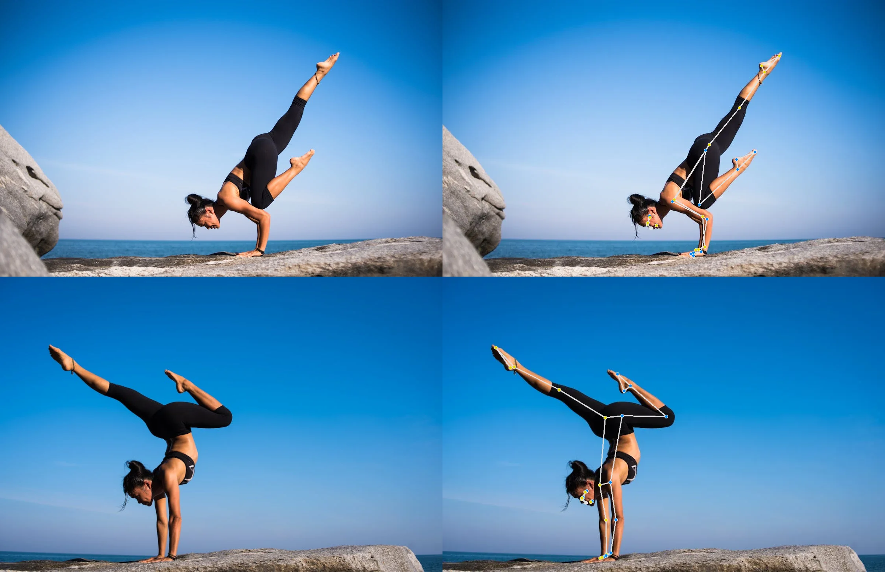

# Detección de Poses con MediaPipe 🕺🤸‍♀️

<p align="center" style="font-size: 15px;">
    No olvides dejar una estrella ⭐ al repositorio y seguirme para más demos 🚀
</p>

<p align="center" style="font-size: 15px;">
    <a href="https://huggingface.co/spaces/AleNunezArroyo/pose-detection-mediapipe" style="text-decoration: underline;">Demo en HugginFace</a> -
    <a href="https://beacons.ai/alenunezarroyo" style="text-decoration: underline;">Mis Redes Sociales</a> 
</p>



## Descripción de la Aplicación 🚀

Esta aplicación permite a los usuarios cargar imágenes y aplicar un modelo de detección de poses para visualizar poses humanas. Combina la interfaz web de **Gradio** con ​**MediaPipe**​, un framework para crear aplicaciones de inteligencia artificial de manera rápida y eficiente.

## Instalar Localmente

### Crear un entorno virtual en Conda

Puedes usar el código sin crear un entorno virtual, pero no es recomendable ya que podría actualizar las librerías de otros proyectos. Para instalar Anaconda, visita este [enlace](https://docs.anaconda.com/anaconda/install/).

```bash
conda create --name mediapipe python=3.11 -y 
conda activate mediapipe
```

### Clonar el repositorio e instalar dependencias

```bash
git clone https://github.com/AleNunezArroyo/pose-detection-mediapipe.git 
cd pose-detection-mediapipe
pip install -r requirements.txt
```


### Ejecutar la aplicación

```bash
gradio app.py
```

## Uso de la Aplicación

* ​**Carga de Imágenes**​: Puedes cargar tus propias imágenes desde la galería, tomar fotografías a través de la interfaz de Gradio o probar los ejemplos.
* ​**Ajuste de Parámetros**​: Puedes ajustar dos parámetros usando deslizadores:
  * `pos`: Define el nivel de confianza mínimo para la detección de poses.
  * `confidence`: Define el número de poses a detectar.
* ​**Visualización de Resultados**​: La imagen cargada es procesada por el modelo de detección de poses, y los resultados se visualizan en la imagen devuelta a la interfaz de Gradio. También puedes descargar la imagen procesada.


